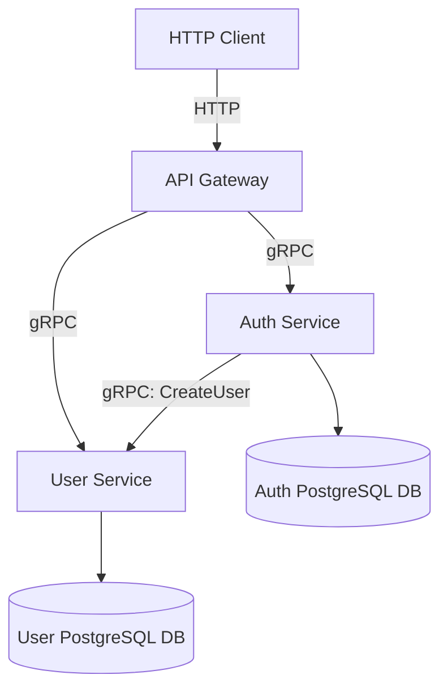

## High-Level Architecture

```mermaid
flowchart TD
    Client[HTTP Client]
    Gateway[API Gateway]
    Auth[Auth Service]
    User[User Service]
    AuthDB[(Auth PostgreSQL DB)]
    UserDB[(User PostgreSQL DB)]

    Client -->|HTTP| Gateway
    Gateway -->|gRPC| Auth
    Gateway -->|gRPC| User
    Auth -->|gRPC: CreateUser| User
    Auth --> AuthDB
    User --> UserDB
```
